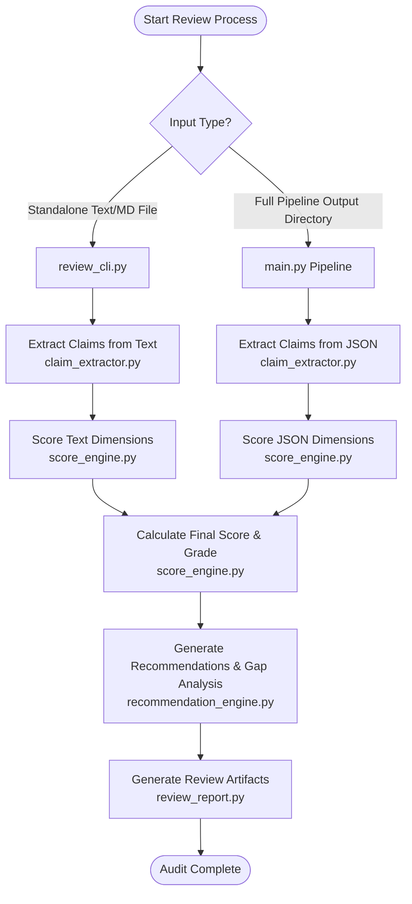

# AI Review & Report Audit System

The **AI Review System** is an automated institutional research auditor and due diligence engine integrated into the BlueOcean Report Intelligence pipeline. It evaluates research reports—either newly generated or existing text/markdown documents—against rigorous professional standards across key dimensions (Research, Evidence, Writing, and Strategy). It scores report sections, extracts and audits claims, identifies gaps, and generates a prioritized blueprint of actionable improvement tasks.

---

## 📋 Table of Contents
1. [Core Features](#-core-features)
2. [Architecture & How It Works](#-architecture--how-it-works)
3. [Environment Setup](#-environment-setup)
4. [How to Run / Execute](#-how-to-run--execute)
5. [Understanding the Output Artifacts](#-understanding-the-output-artifacts)
6. [Scoring & Grading Scheme](#-scoring--grading-scheme)

---

## ✨ Core Features

*   **Deep Claim Auditing**: Automatically parses report content to extract all major claims, statistics, and forecasts, evaluating each for evidence, data, sources, quantification, and justified confidence.
*   **Section-by-Section Scorecard**: Moves away from flat document-level scores to assign granular, auditable evaluation scores for Research, Evidence, Writing, and Strategic metrics on every section.
*   **Actionable Gap Analysis**: Identifies data gaps (missing market sizes, benchmarks), weak assumptions, writing flaws, narrative/structural disconnects, and strategic omissions.
*   **GCC Relevance Check**: Evaluates if the report content addresses the specific context, challenges, and value propositions relevant to Gulf Cooperation Council (GCC) stakeholders.
*   **Executive Readiness Assessment**: Checks if the document is ready for target audiences including government Ministers, Board Directors, and Sovereign Wealth Funds (SWFs).
*   **Prioritized Action Plan**: Outputs a concrete list of improvement tasks with recommended fixes, severity levels, and expected impact.

---

## 🛠️ Architecture & How It Works

The review system utilizes the Groq API (powered by the `llama-3.3-70b-versatile` model) to run reports through a multi-stage audit pipeline:



### 1. Claim Extraction (`claim_extractor.py`)
Parses the report and analyzes every major claim, finding, forecast, or statistic against five validation criteria:
1.  **Evidence Provided**: Is there qualitative evidence supporting this?
2.  **Data Provided**: Is there supporting data/numbers?
3.  **Source Referenced**: Is a reputable source cited?
4.  **Quantified**: Are there specific quantities/metrics rather than vague terms?
5.  **Confidence Justified**: Is the level of confidence justified by the data?

Claims are classified as **Supported**, **Weak**, **Unsupported**, or **High-Risk**. The engine also computes a **Quantification Ratio** (percentage of quantified vs. non-quantified statements).

### 2. Dimension Scoring (`score_engine.py`)
Performs a section-by-section audit of the report across four core dimensions:
*   **Research**: Assesses coverage, depth, breadth, comparative analysis, and scenario analysis.
*   **Evidence**: Verifies data grounding, citations, and factual backing.
*   **Writing**: Evaluates clarity, flow, readability, and tone.
*   **Strategic**: Measures relevance, logic, and actionable insights.

For each section and dimension, it returns an **Auditable Evaluation Object**:
*   `score`: Integer between 0 and 100.
*   `confidence`: High, Medium, or Low.
*   `positive_factors`: Strengths identified in the section.
*   `negative_factors`: Weaknesses or gaps identified.
*   `score_breakdown`: Granular breakdown of sub-metrics.

### 3. Recommendation & Gap Analysis (`recommendation_engine.py`)
Examines findings to diagnose:
*   **Strengths & Weaknesses**: Grounded in actual report content.
*   **Data Gaps & Weak Assumptions**: Highlighted by severity (Critical, High, Medium, Low).
*   **Writing Flaws**: Flagging vague statements, spelling issues, or improper terminology.
*   **Narrative & Strategic Gaps**: Disconnects between problem analysis and recommendations.
*   **GCC Relevance**: Alignment with GCC region stakeholders.
*   **Executive Communication**: Evaluates readiness (Yes/No) for Ministers, Board Directors, and SWF representatives, flagging specific problem sections.
*   **Improvement Tasks**: Formulates structured, actionable recommendations, expected impact, and recommended fixes.

### 4. Artifact Generation (`review_report.py`)
Compiles the raw results into machine-readable JSON schemas and beautifully styled human-readable markdown reports.

---

## ⚙️ Environment Setup

Before running the review system, ensure you have the required API keys and Python libraries.

### 1. Requirements
Install the project dependencies if you haven't already:
```bash
pip install -r requirements.txt
```
> **Note**: The review CLI relies on `python-dotenv` to load environment variables from a `.env` file. You can install it using:
> `pip install python-dotenv`

### 2. Configure API Keys
Create or update the `.env` file in the root of the project:
```ini
GROQ_API_KEY=your_groq_api_key_here
```
Replace `your_groq_api_key_here` with your valid Groq API key.

---

## 🚀 How to Run / Execute

The review system can be run in two ways:

### Mode A: Standalone CLI (Reviewing Existing Files)
Use this mode to audit any existing text or markdown report file.

```bash
python -m gen_rpt.review_cli --file <path_to_report_file> [--out-dir <output_directory>]
```

#### CLI Parameters:
*   `--file` (Required): Path to the markdown or text file you want to review (e.g., `test_report.md`).
*   `--out-dir` (Optional): The base directory where the review outputs will be saved. Defaults to `review_output`.

#### Example Command:
```bash
python -m gen_rpt.review_cli --file test_report.md
```

#### Output Behavior:
The CLI automatically creates a unique subdirectory inside the base output directory using the file name and the current timestamp:
`review_output/<file_name>_review_YYYYMMDD_HHMMSS/`

---

### Mode B: Integrated Pipeline Run (Embedded Execution)
The review system is embedded directly into the report generation pipeline (`gen_rpt/main.py`). When generating a new report:

```bash
python -m gen_rpt.main --topic "Your deep research topic" --language en
```

#### Pipeline Integration Details:
1.  The report pipeline completes research, synthesis, and asset generation.
2.  The pipeline automatically calls `run_groq_review(output_dir)`.
3.  The review engine processes the generated `report_payload.json` and `sources.json`.
4.  All review outputs are written directly into the corresponding generated report folder:
    `reports/YYYY-MM-DD-<slug>/`
5.  It automatically updates the report's `manifest.json` with the overall review score and grade.

> [!TIP]
> The review pipeline runs inside a non-blocking `try...except` block, ensuring that if the Groq API fails or times out, the main report generation will still finish successfully.

---

## 📂 Understanding the Output Artifacts

For every execution, the review system outputs five standard files:

| File Name | Format | Description |
| :--- | :--- | :--- |
| **`review_report.md`** | Markdown | A premium, human-readable audit report containing section scores, lists of weaknesses/strengths, gaps, and a full task list of recommended fixes. |
| **`review_summary.txt`** | Text | A concise, high-level textual summary showing the final score, grade, top 3 strengths, and top 3 priority improvement tasks. |
| **`review_report.json`** | JSON | The master data file containing all raw scores, section-by-section dimension evaluations, claim classifications, and recommendations. |
| **`improvement_tasks.json`**| JSON | An action-oriented list of improvement tasks extracted from the audit, ideal for consumption by frontend dashboards or automated editors. |
| **`claims.json`** | JSON | Contains all extracted claims, their sections, validation metrics (evidence, data, source, quantified, justified), and final classification labels. |

---

## 📊 Scoring & Grading Scheme

The final score is calculated by mathematically averaging the four dimension scores (Research, Evidence, Writing, and Strategic) across all evaluated sections of the report.

Based on the final averaged score (out of 100), the report is assigned one of the following official grades:

| Score Range | Grade | Description | Action Required |
| :--- | :--- | :--- | :--- |
| **95.0 – 100** | 🏆 **Platinum** | Outstanding document. Grounding and evidence are flawless. | Ready for immediate submission. |
| **90.0 – 94.9** | 🥇 **Gold** | Exceptional quality with minor gaps or minor writing style tweaks. | Ready for stakeholders with minor polish. |
| **80.0 – 89.9** | 🥈 **Silver** | Good foundation, but lacks deep quantification or has minor logical gaps. | Address "High" severity tasks before release. |
| **70.0 – 79.9** | 🥉 **Bronze** | Report is readable but contains unsupported assumptions or data gaps. | Substantial edits recommended. |
| **< 70.0** | ⚠️ **Revision Required** | Document lacks sufficient evidence, has major data gaps, or weak arguments. | **Do not distribute.** Must be revised. |
